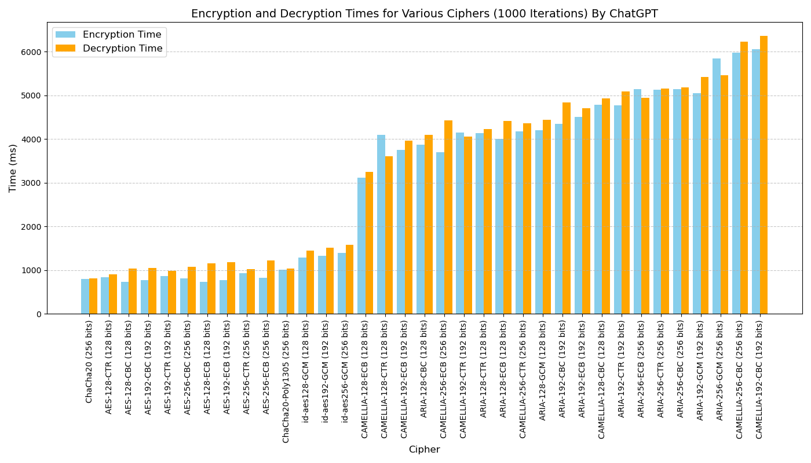

**Encryption speeds (in term of encryption + decryption time, loop max for both encryption and decryption is 1000) **



**TODO:**

1. Implement kademlia listen agent.
2. Implement kademlia keep alive agent.
3. Implement store peer info dht.
   

**Compile:**

```bash
mkdir build && cd build
cmake .. -DLITE_P2P_TEST_TOOLS=ON -DCMAKE_BUILD_TYPE=Debug
make
```

**Compile with a buildenv:**

```bash
mkdir build && cd build
. ../buildenv/<env-file>.env
cmake .. -DLITE_P2P_TEST_TOOLS=ON -DCMAKE_BUILD_TYPE=Debug
make
```
